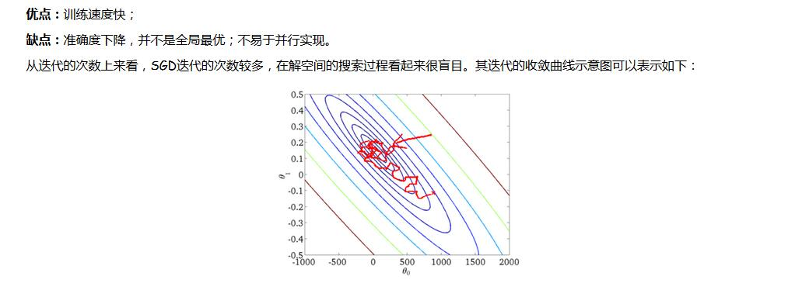

Gradient Descent
=========================================================================

## Content
* [BGD](#bgd)

* [SGD](#sgd)

* [mBGD](#mbgd)

* [Notes](#notes)

    

### BGD
---------------------------------------------------------------------------

### SGD
----------------------------------------------------------------------------

### mBGD
----------------------------------------------------------------------------

### Notes
----------------------------------------------------------------------------
* Batch gradient descent: Use all examples in each iteration(每次迭代使用所有样例)。
* Stochastic gradient descent: Use 1 example in each iteration(每次迭代使用一个样例)。
* Mini-batch gradient descent: Use b examples in each iteration(每次迭代使用b个样例)。

Source: http://www.cnblogs.com/maybe2030/p/5089753.html#_label2
